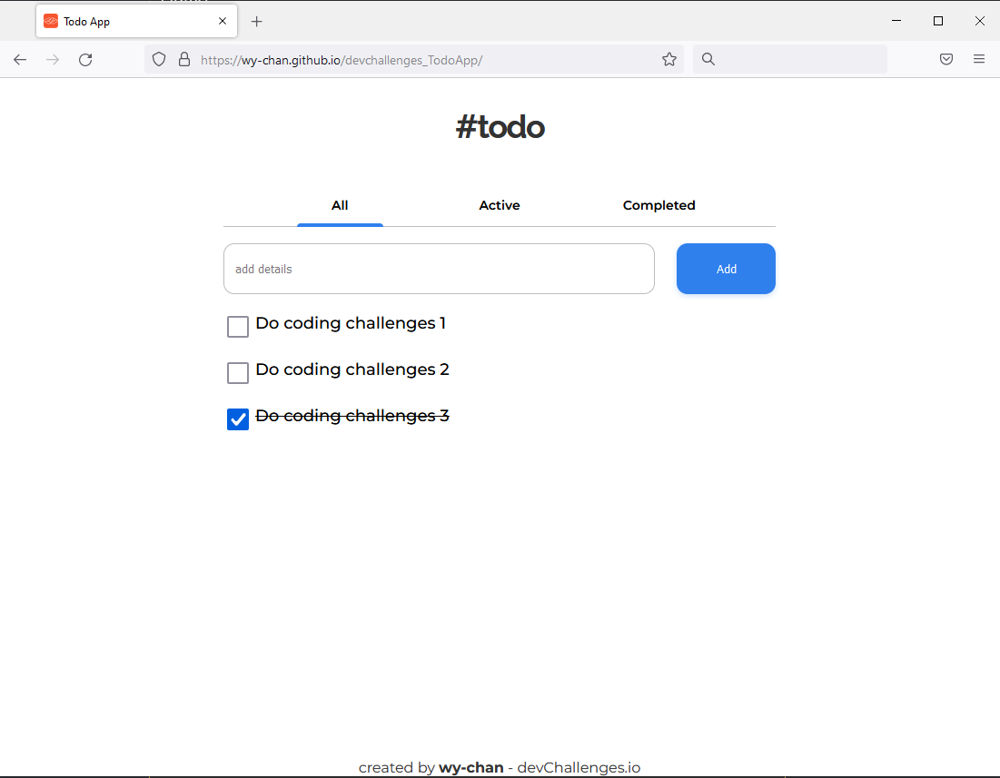
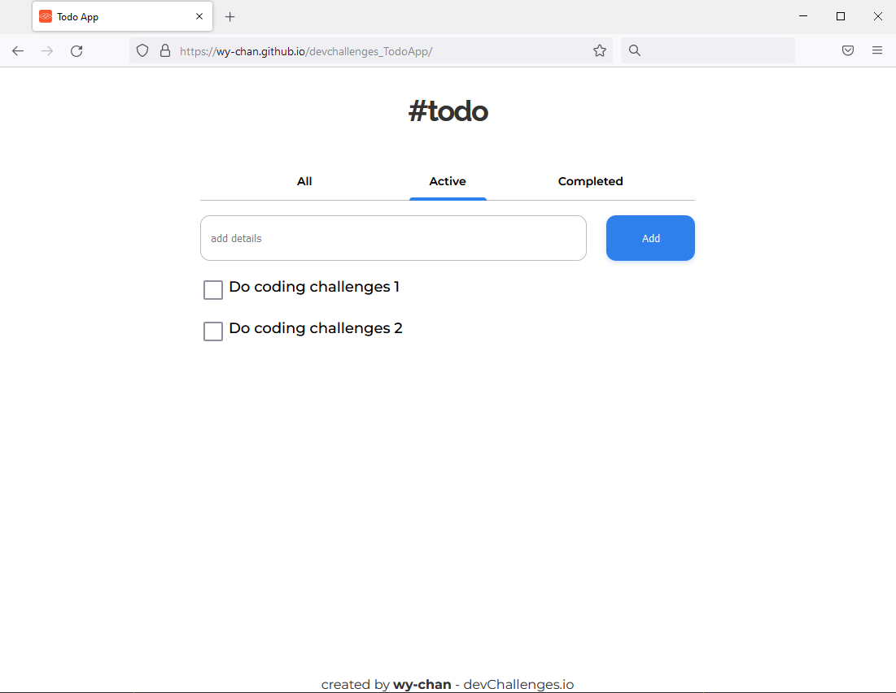
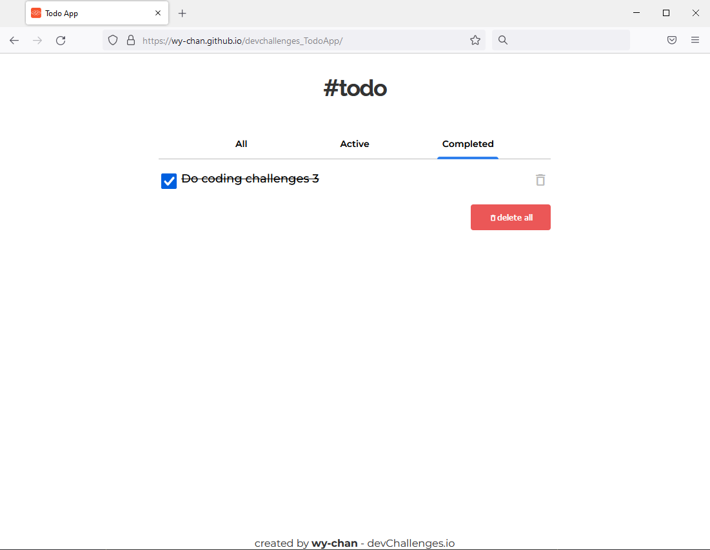

<!-- Please update value in the {}  -->

<h1 align="center" id="button">Todo App</h1>

   Solution for a challenge from  <a href="http://devchallenges.io" target="_blank">Devchallenges.io</a>.

  <h3>
    <a href="https://wy-chan.github.io/devchallenges_RandomQuoteGenerator">
      Demo
    </a>
     | 
    <a href="https://github.com/wy-chan/devchallenges_RandomQuoteGenerator">
      Solution
    </a>
     | 
    <a href="https://devchallenges.io/challenges/8Y3J4ucAMQpSnYTwwWW8">
      Challenge
    </a>
  </h3>

<!-- TABLE OF CONTENTS -->

## Table of Contents

- [Overview](#overview)
  - [Built With](#built-with)
- [Features](#features)
- [How to use](#how-to-use)
- [Contact](#contact)
- [Acknowledgements](#acknowledgements)

<!-- OVERVIEW -->

## Overview

   
   
   
   

See demo here: https://wy-chan.github.io/devchallenges_RandomQuoteGenerator/

Challenge: Create a quote generator app. 

### Built With

- HTML
- CSS
- JavaScript
- [React](https://reactjs.org/)

## Features

<!-- List the features of your application or follow the template. Don't share the figma file here :) -->

This application/site was created as a submission to a [DevChallenges](https://devchallenges.io/challenges) challenge. The [challenge](https://devchallenges.io/challenges/8Y3J4ucAMQpSnYTwwWW8) was to build an application to complete the following user stories:

- [x] User story: I can see a random quote
- [x] User story: I generate a new random quote
- [x] User story: When I select quote author, I can see a list of quotes from them
- [x] User story: I can see quote genre under the author

## Acknowledgements

<!-- This section should list any articles or add-ons/plugins that helps you to complete the project. This is optional but it will help you in the future. For exmpale -->

- [Steps to replicate a design with only HTML and CSS](https://devchallenges-blogs.web.app/how-to-replicate-design/)
- [Marked - a markdown parser](https://github.com/chjj/marked)

- [Google Fonts](https://fonts.google.com/)
- [Material Icons](https://google.github.io/material-design-icons/)

## Contact

- GitHub [@wy-chan](https://github.com/wy-chan)
- CodePen [@wy-chan](https://codepen.io/wy-chan)
